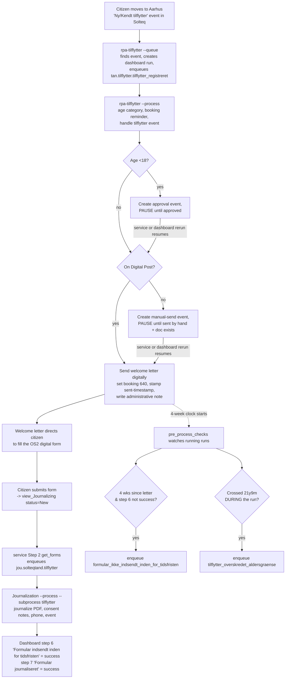

# Tilflytter — Solution Overview

Onboarding guide for the "Tilflytter til Aarhus Kommune" automation. It welcomes citizens who move
to Aarhus into the municipal dental service (Tandplejen), sends them a welcome letter, gets them to
fill out a digital consent form, journalizes that form, and tracks deadlines/age limits along the way.

The solution is **not one program** — it's four moving parts coordinated through a shared process
dashboard, a Solteq Tand database, OS2Forms, and Automation Server (ATS) workqueues. Understanding the
seams between them is the whole game.

---

## 1. The moving parts

| Component | Repo | Role |
|---|---|---|
| **Main RPA** | `rpa-tilflytter` | Detects new movers in Solteq, sends the welcome letter, creates the booking reminder + events, enforces deadlines/age limits. |
| **Journalization RPA** | `MBU_Journalisering_SolteqTand_ATS` | Journalizes the citizen's submitted OS2Form, records consent, updates phone, creates the "form received" event. Multi-purpose (tilflytter is one `--subprocess`). |
| **Polling service** | `service-tandplejen-procesoverblik` | Windows service, 5-min loop. Feeds the journalization queue from submitted forms, and resumes paused RPA items. |
| **Shared UI/DB library** | `MBU_SolteqTand_Shared_Components` | `mbu_solteqtand_shared_components` — Solteq UI automation + DB helpers. **Vendored (copied) into every repo's `.venv`.** |

External systems they all lean on:
- **Solteq Tand** — the dental record system. Automated two ways: SQL reads (`SolteqTandDatabase`) and UI automation (`SolteqTandApp`).
- **Process Dashboard** — one run per citizen on process **"Tilflytter til Aarhus Kommune"**, shared by all three RPAs/services. This is the backbone that lets decoupled components coordinate. Backend: `Process_Dashboard_API`; client library: `MBU_Process_Dashboard_Shared_Components` (`mbu_process_dashboard_shared_components`).
- **OS2Forms** — the citizen-facing digital form. Submissions land in SQL view `RPA.journalizing.view_Journalizing`.
- **Automation Server (ATS)** — hosts the workqueues each RPA processes.

---

## 2. End-to-end flow (happy path)

**In words:**
1. A citizen moving to Aarhus produces a **"Ny tilflytter" / "Kendt tilflytter"** event in Solteq.
2. `rpa-tilflytter --queue` finds those events, creates the **dashboard run**, and enqueues a work item to `tan.tilflytter.tilflytter_registreret`. It also runs `pre_process_checks` (see §5).
3. `rpa-tilflytter --process` handles the item: determines **age category**, creates the **booking reminder** (3 months out), processes the tilflytter event, and — subject to age and Digital Post — **sends the welcome letter** (or pauses; see §4), then writes the administrative journal note.
4. The welcome letter directs the citizen to complete the **OS2 digital form** (consent + previous clinic).
5. The submitted form lands in `view_Journalizing`. The **service's Step 2 (`get_forms`)** picks it up and enqueues it to `jou.solteqtand.tilflytter`.
6. The **journalization RPA** journalizes the form PDF (`Kvittering_Tilflytter.pdf`), writes the consent notes, updates the phone number, creates the **"Tilflytter - Digital formular modtaget"** event, and marks dashboard **step 6 = success** ("form submitted in time") and **step 7 = success** ("form journalized").
7. Back in `rpa-tilflytter`, `pre_process_checks` (run every `--queue`) watches all running runs for two exceptions: **missed form deadline** and **age limit crossed mid-run** (§5).

---

## 3. How the components interact (the seams)

- **Everything coordinates through the shared dashboard run.** No component calls another directly. The RPA writes the run + step statuses; the journalization RPA writes steps 6/7; `pre_process_checks` reads step statuses and meta to make decisions. If you change a step name in one place, you break the others — and one such mismatch exists today, see §7.
- **The journalization queue is filled by the SERVICE, not by the journalization repo.** `MBU_Journalisering_SolteqTand_ATS/processes/queue_handler.py::retrieve_items_for_queue` returns an **empty list** — that's intentional. `service .../get_forms.py` reads the SQL form view and calls `workqueue.add_item(...)` on `jou.solteqtand.tilflytter` directly. So "how do forms get processed?" → the service, on its 5-minute loop.
- **The service resumes the RPA's paused items.** When the RPA pauses an item (`BusinessError` → *pending user action*), it sits in `tan.tilflytter.tilflytter_registreret`. The service's Step 5 (`tilflytter_afventer_udsendelse`) polls, checks Solteq for the resume condition, and flips the item back to `new` so the RPA re-runs it.
- **The dashboard can also resume a paused item (manual rerun).** Every `BusinessError` in `process_item` is reported to the dashboard step it stopped on with `rerun_config={"workitem_id": <ATS work item id>}`. The dashboard API's rerun endpoint (`Process_Dashboard_API/app/adapters/automation_server_adapter.py`) reads that id and PUTs the work item's status back to `new` — the same flip the service's Step 5 does, but triggered by a human from the dashboard. That's why `ats_functions.get_item_info` returns `item.id` and `process_item` takes `item_id`: without the id on the step run, the dashboard has no rerun target.
- **Cross-process cancellation (fritvalg).** If a citizen instead chooses a private clinic (submits the *fritvalg* form), `get_forms` finds their active tilflytter run and sets the "Borger har valgt privat tandklinik" step to **cancelled** — a tilflytter run can be ended by an entirely different form.

---

## 4. Complex operation #1 — pause / resume (idempotency)

The RPA can't sit and wait for a human (approval or a manual letter send), so it **pauses and is resumed later**. Two pause points exist:

| Pause | When | Resume condition (checked by the service) |
|---|---|---|
| **Under-18 approval** | Citizen < 18 — the welcome letter needs Tandplejen approval first | Event `"Tilflytter - Godkend afsendelse af velkomstbrev"` is **handled/archived** |
| **Manual send** | Citizen **not** on Digital Post — letter must be sent by hand | Event `"Tilflytter - Ikke tilmeldt digital post - udsend brev manuelt"` handled **AND** a `Velkomstbrev` document exists |

**How pause works:** the RPA raises `BusinessError`. `process_item` catches it, reports the step it stopped on to the dashboard, and re-raises; `main.py` then hands `item.pending_user` to `handle_error`, which calls it with the serialized error so the work item's message carries the full error payload.

**Which dashboard step gets reported:** `process_item` tracks `current_step_name` / `current_step_status` as the flow advances, and the `except BusinessError` handler reports *that* step. The two deliberate pauses above set the status to `pending` before raising (they are waiting, not failing); anything else — including the `BusinessError`s raised inside `helpers/solteq_helper.py` when an expected event is missing — is reported as `failed`. Either way the work item id goes along as the rerun target.

**How resume works:** the service (or a human, from the dashboard) sets the item back to `new`.

**Why this is safe (the golden rule):** every `check_and_*` helper in the RPA **re-reads Solteq state and only acts if the action hasn't already been done**, then verifies it. So the RPA can be re-run any number of times without duplicating work or sending the letter twice. This is why coarse resume triggers are acceptable — if the service resumes too eagerly, the RPA just re-validates and re-pauses.

**Phase-aware resume (a subtle bug we designed around):** an under-18 citizen who is *also* not on Digital Post hits **both** pauses in sequence. If the service naively checked "approval OR manual-send done", the already-given approval would keep re-queuing the item forever during the second pause. So `_is_ready_to_resume` is **phase-aware**: if the manual-send event exists, it's in the manual-send phase and only that condition counts; otherwise it's in the approval phase.

---

## 5. Complex operation #2 — deadlines & age limits (`pre_process_checks`)

Runs at the start of every `--queue`. For each **running** dashboard run it flags two exceptions to their own queues:

- **Missed form deadline** → `tan.tilflytter.formular_ikke_indsendt_inden_for_tidsfristen`
- **Crossed 21y 9m during the run** → `tan.tilflytter.tilflytter_overskredet_aldersgraense`

Three rules that trip people up:

1. **The 4-week clock (`FORM_DEADLINE_WEEKS`) runs from when the welcome letter was actually sent**, not from when the run started. That's the entire reason `welcome_document_sent_timestamp` exists in the run meta and is `None` until the letter goes out. An under-18 citizen paused for weeks awaiting approval has **no clock running** and can't be flagged late.
2. **"Still running" ≠ "didn't submit."** A tilflytter run stays `running` through the whole post-submission chain. So the deadline check only fires when the run is past deadline **AND** the form-submission step (written by the journalization RPA) is **not** `success`. Without that step check it would falsely flag citizens who *did* submit.
3. **The age check flags "crossed the line", not "is over the line."** A citizen who was **already** past 21y9m when their run was created is left alone — they never had an age limit to miss, the main flow already marks their "Tilflytter under 21 år og 9 måneder" step `optional` at registration, and queueing them here would create a "Formular ikke udfyldt" event they should never get. `has_newly_exceeded_age_limit` therefore compares two points in time:
   - **now** → `get_age_category(cpr, on_date=today)`
   - **at run creation** → `run["meta"]["age_category"]`, the category computed once at registration and deliberately never recomputed (§6).

   Only *below the limit then, over it now* gets queued. For older runs whose meta predates `age_category`, `run_created_date(run)` dates the run from the earliest step run's `created_at` and the category is recomputed as of that date — the dashboard's `/runs/` payload (`ProcessRunPublic`) carries no `created_at` of its own and never sets `started_at`, but `ProcessStepRunPublic` does, and step runs are created together with the run. If neither signal is available the run is **skipped with a warning** rather than flagged, since a spurious age-limit event in Solteq is a visible mistake.

---

## 6. Domain rules worth knowing

- **Age categories (5 categories, 5 letter templates).** Age decides the welcome-letter template and whether approval is needed: `0_to_5`, `6_to_14`, `15_to_17`, `18_to_21y8m`, `21y9m_and_older` → `"Tilflytter 0-5 år - Velkommen"` … `"Tilflytter 21 år 9 mdr - Velkommen"`. Under-18 → booking status "Tilflytter - Afventer godkendelse" (needs approval); 18+ → "Tilflytter - Afsendelse godkendt".
- **Age is computed ONCE and stored in run meta**, then reused on every resume — so a citizen who crosses an age boundary while paused doesn't switch templates mid-flow. The **only** exception (crossing 21y9m) is handled deliberately by `pre_process_checks`, not in `process_item` — and that check *depends* on the stored category to tell "crossed during the run" from "was over the limit all along" (§5, rule 3).
- **Booking status: numbers in the DB, text in the UI.** Solteq stores the appointment status as a numeric id (**636** Afventer godkendelse, **638** Afsendelse godkendt, **640** Velkomstbrev udsendt) but the UI dropdown is selected by its **text label**. The booking reminder is *created* with the status text; the later update goes through `check_and_set_booking_status`, which takes both: `status_id` (640) for the DB check/verify and `status_text` for the UI. **DB filters must use the ids.**
- **The tilflytter booking is an admin booking.** `check_and_create_booking_reminder` creates it with booking type / dentist / chair all set to `"Z - Tilflytter"`, which is why saving it always trips the "no availability" warning that `change_appointment_status_handle_warning` has to approve.
- **Journal notes are a type plus a message, and the database stores only the message.** A note is written in the UI as `"<type> <message>"` — e.g. `Administrativt notat 'Velkomstbrev er sendt. Se Dokumenter'` — but Solteq splits the two apart: the type is the note's category, and `dn.Beskrivelse` holds just the message, without the quotes it is displayed in. `check_and_create_journal_note` takes `note_type` and `note_message` separately for exactly this reason; `journal_note_db_value()` derives the lookup value. Same convention as the journalization repo's `ADM_NOTE_TYPE` / `ADM_NOTE_MESSAGE` config pairs.
- **Consent drives the journal notes (journalization RPA).** The form's `journal_samtykke` and `behandling_samtykke` each branch to a different Administrativt/Diagnose note. Treatment consent additionally creates a diagnose note **plus** a sub-note.

---

## 7. Caveats & pitfalls (read before you touch anything)

- **⚠️ Dashboard step-name mismatch — reconcile before go-live.** `rpa-tilflytter` uses the step name **`"Formular indsendt"`** (`pre_process_checks.py`, and the missed-deadline branch of `process_item.py`), while the journalization RPA writes **`"Formular indsendt inden for tidsfristen"`** (`MBU_Journalisering_SolteqTand_ATS/.../tilflytter/config.py::DASHBOARD_STEP_6_NAME`). Only one of these can match the dashboard's actual step list, and the failure modes differ by side: `pre_process_checks` resolves the id locally with `next(..., None)`, so a miss logs a warning and then **over-flags every past-deadline citizen** (no step run can match a `None` step id); `handle_process_dashboard` resolves it through `get_step_run_id_for_process_step_cpr`, which **raises** `RuntimeError` on an unknown step name. Check the name in the dashboard and fix whichever repo is wrong.
- **Danish hyphen vs en-dash.** Event/status strings must match Solteq **byte-for-byte** across all repos. Spec/Word docs auto-format `- ` into `–` (en-dash, U+2013); Solteq uses a regular hyphen (U+002D). A mismatched dash silently breaks event matching. Copy from working code, not from the spec doc.
- **Don't "correct" strings to match the Visio drawing.** The process drawing ("Tilflytter - Procestegning") is loosely worded (e.g. it calls status 638 "Velkomstbrev godkendt"). The **code values are authoritative**; the drawing is not.
- **Solteq's UI is ahead of its database.** A UI action is confirmed by re-reading the database, and that read can lag the click by seconds — journal notes especially, since `get_list_of_journal_notes` joins through `Forloeb → ForloebSymbolisering → DiagnoseStatus`. `check_and_create_journal_note` therefore **polls** for up to 30 seconds (`JOURNAL_NOTE_CONFIRM_*`) instead of checking once. The other `check_and_*` helpers still use a single `time.sleep(3)` before their verify — if one of them starts failing on work you can watch succeed, that's the first thing to widen. Note that a retry loop is only safe as a *poll*: re-running a creation action risks a duplicate event or note.
- **`SolteqTandApp` has one `app_window`, and handlers fight over it.** The app class inherits from every handler in `mbu_solteqtand_shared_components`, so they all share a single `self.app_window`. The appointment handler reassigns it to the booking pane it just edited (`self.app_window = booking_control` in `appointment.py`) and never restores it, so the next handler that navigates the patient card searches the wrong subtree: `open_tab()` finds no tab, returns `None`, and dies on `'NoneType' object has no attribute 'GetPattern'` — even though the patient window is open and the booking update succeeded. Two workarounds exist for the same leak: `close_patient_window` re-acquires `FormPatient` upstream, and `solteq_helper.refocus_patient_window()` does it for the steps in between (called right after the booking-status change). **The underlying leak in `appointment.py` is still there** — call `refocus_patient_window` after any appointment/booking action before touching the patient card again.
- **Shared library is vendored into 7+ repos.** `mbu_solteqtand_shared_components` lives in `MBU_SolteqTand_Shared_Components` (source) but is **copied** into each repo's `.venv/`. A source fix does **not** reach the others until the package is republished/reinstalled. During dev we mirror edits into the relevant `.venv` copy by hand.
  - Related trap: the UI handlers report success even when they did nothing. `process_target_event` no-ops (and still prints "Event processed") when the target row isn't in the grid; `create_new_event` swallows its own exceptions entirely. The database check in the caller is the *only* real confirmation.
- **The multi-place checking is intentional, not redundant.** Readiness is detected in the service while the RPA is dormant, and re-validated in the RPA for idempotency. That duplication is the price of a decoupled, resumable design.

---

## 8. Where to look / how to run

**rpa-tilflytter** (main): `main.py` reads bare flags from `sys.argv` (no argparse):

| Flag | What it does |
|---|---|
| `--queue` | Run `pre_process_checks`, find unhandled tilflytter events, enqueue work items. |
| `--process` | Process the workqueue. **Requires one branch flag below** — `process_item` selects its behaviour from `sys.argv`, and with none of them present it opens the patient and does nothing. |
| `--finalize` | Currently a no-op placeholder (`processes/finalize_process.py`). |

Branch flags for `--process`, one per outcome queue:

| Flag | Branch |
|---|---|
| `--tilflytter_registreret` | The main flow (age category → booking reminder → event → letter → note). |
| `--formular_ikke_indsendt_inden_for_tidsfristen` | Record the missed-deadline outcome as a Solteq event + dashboard step. |
| `--tilflytter_overskredet_aldersgraense` | Record the age-limit outcome as a Solteq event + dashboard step. |

Code layout: main flow in `processes/process_item.py`; Solteq actions (all the `check_and_*` helpers, plus `refocus_patient_window`) in `helpers/solteq_helper.py`; deadlines/age in `helpers/pre_process_checks.py`; dashboard + age/CPR helpers in `helpers/helper_functions.py`; queue population in `processes/queue_handler.py`; Solteq app lifecycle (`startup`/`close`/`reset`) in `processes/application_handler.py`; error reporting + error mail in `processes/error_handling.py`; tunables in `helpers/config.py`.

**Journalization**: `main.py --process --subprocess tilflytter`. Tilflytter logic in `processes/sub_processes/tilflytter/` (`process.py`, `handler.py`, `config.py`, `set_context.py`); form download in `processes/shared/handlers/os2forms_handler.py`; journalizing in `processes/shared/handlers/journalizing/`.

**Service**: `service.py` runs a 5-minute loop. Tilflytter-relevant steps: **Step 2** `get_forms.py` (forms → journalization queue) and **Step 5** `tilflytter_afventer_udsendelse.py` (resume paused RPA items).

**Key queue names:**
- `tan.tilflytter.tilflytter_registreret` — main RPA queue (paused items live here)
- `tan.tilflytter.formular_ikke_indsendt_inden_for_tidsfristen` — missed-deadline outcome
- `tan.tilflytter.tilflytter_overskredet_aldersgraense` — age-limit outcome
- `jou.solteqtand.tilflytter` — journalization queue (filled by the service)
