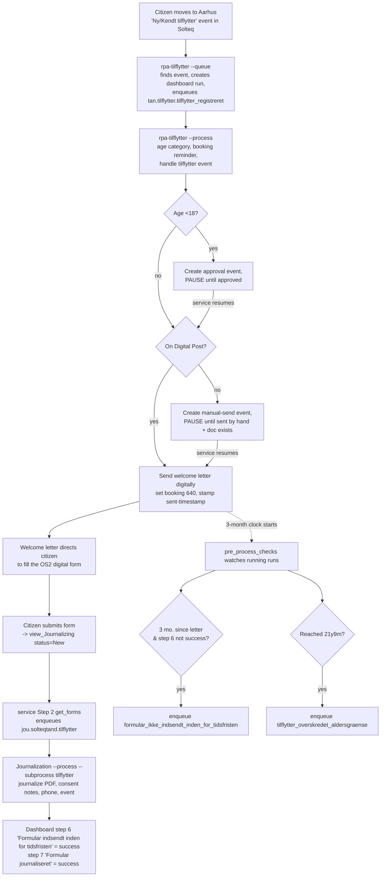

# Tilflytter — Solution Overview

Onboarding guide for the "Tilflytter til Aarhus Kommune" automation. It welcomes citizens who move
to Aarhus into the municipal dental service (Tandplejen), sends them a welcome letter, gets them to
fill out a digital consent form, journalizes that form, and tracks deadlines/age limits along the way.

The solution is **not one program** — it's four moving parts coordinated through a shared process
dashboard, a Solteq Tand database, OS2Forms, and Automation Server (ATS) workqueues. Understanding the
seams between them is the whole game.

---

## 1. The moving parts

| Component | Repo | Role |
|---|---|---|
| **Main RPA** | `rpa-tilflytter` | Detects new movers in Solteq, sends the welcome letter, creates the booking reminder + events, enforces deadlines/age limits. |
| **Journalization RPA** | `MBU_Journalisering_SolteqTand_ATS` | Journalizes the citizen's submitted OS2Form, records consent, updates phone, creates the "form received" event. Multi-purpose (tilflytter is one `--subprocess`). |
| **Polling service** | `service-tandplejen-procesoverblik` | Windows service, 5-min loop. Feeds the journalization queue from submitted forms, and resumes paused RPA items. |
| **Shared UI/DB library** | `MBU_SolteqTand_Shared_Components` | `mbu_solteqtand_shared_components` — Solteq UI automation + DB helpers. **Vendored (copied) into every repo's `.venv`.** |

External systems they all lean on:
- **Solteq Tand** — the dental record system. Automated two ways: SQL reads (`SolteqTandDatabase`) and UI automation (`SolteqTandApp`).
- **Process Dashboard** — one run per citizen on process **"Tilflytter til Aarhus Kommune"**, shared by all three RPAs/services. This is the backbone that lets decoupled components coordinate.
- **OS2Forms** — the citizen-facing digital form. Submissions land in SQL view `RPA.journalizing.view_Journalizing`.
- **Automation Server (ATS)** — hosts the workqueues each RPA processes.

---

## 2. End-to-end flow (happy path)

**In words:**
1. A citizen moving to Aarhus produces a **"Ny tilflytter" / "Kendt tilflytter"** event in Solteq.
2. `rpa-tilflytter --queue` finds those events, creates the **dashboard run**, and enqueues a work item to `tan.tilflytter.tilflytter_registreret`. It also runs `pre_process_checks` (see §5).
3. `rpa-tilflytter --process` handles the item: determines **age category**, creates the **booking reminder** (3 months out), processes the tilflytter event, and — subject to age and Digital Post — **sends the welcome letter** (or pauses; see §4).
4. The welcome letter directs the citizen to complete the **OS2 digital form** (consent + previous clinic).
5. The submitted form lands in `view_Journalizing`. The **service's Step 2 (`get_forms`)** picks it up and enqueues it to `jou.solteqtand.tilflytter`.
6. The **journalization RPA** journalizes the form PDF (`Kvittering_Tilflytter.pdf`), writes the consent notes, updates the phone number, creates the **"Tilflytter - Digital formular modtaget"** event, and marks dashboard **step 6 = success** ("form received") and **step 7 = success** ("form journalized").
7. Back in `rpa-tilflytter`, `pre_process_checks` (run every `--queue`) watches all running runs for two exceptions: **missed form deadline** and **age-limit exceeded** (§5).

---

## 3. How the components interact (the seams)

- **Everything coordinates through the shared dashboard run.** No component calls another directly. The RPA writes the run + step statuses; the journalization RPA writes steps 6/7; `pre_process_checks` reads step statuses and meta to make decisions. If you change a step name in one place, you break the others.
- **The journalization queue is filled by the SERVICE, not by the journalization repo.** `MBU_Journalisering_SolteqTand_ATS/processes/queue_handler.py::retrieve_items_for_queue` returns an **empty list** — that's intentional. `service .../get_forms.py` reads the SQL form view and calls `workqueue.add_item(...)` on `jou.solteqtand.tilflytter` directly. So "how do forms get processed?" → the service, on its 5-minute loop.
- **The service resumes the RPA's paused items.** When the RPA pauses an item (`BusinessError` → `pending_user`), it sits in `tan.tilflytter.tilflytter_registreret` as *pending user action*. The service's Step 5 (`tilflytter_afventer_udsendelse`) polls, checks Solteq for the resume condition, and flips the item back to `new` so the RPA re-runs it.
- **Cross-process cancellation (fritvalg).** If a citizen instead chooses a private clinic (submits the *fritvalg* form), `get_forms` finds their active tilflytter run and sets the "Borger har valgt privat tandklinik" step to **cancelled** — a tilflytter run can be ended by an entirely different form.

---

## 4. Complex operation #1 — pause / resume (idempotency)

The RPA can't sit and wait for a human (approval or a manual letter send), so it **pauses and is resumed later**. Two pause points exist:

| Pause | When | Resume condition (checked by the service) |
|---|---|---|
| **Under-18 approval** | Citizen < 18 — the welcome letter needs Tandplejen approval first | Approval event `"Godkend afsendelse af velkomstbrev"` is **handled/archived** |
| **Manual send** | Citizen **not** on Digital Post — letter must be sent by hand | Event `"Tilflytter - Ikke tilmeldt digital post - udsend brev manuelt"` handled **AND** a `Velkomstbrev` document exists |

**How pause works:** the RPA raises `BusinessError`; `main.py` catches it and calls `item.pending_user()`. **How resume works:** the service sets the item back to `new`.

**Why this is safe (the golden rule):** every `check_and_*` helper in the RPA **re-reads Solteq state and only acts if the action hasn't already been done**, then verifies it. So the RPA can be re-run any number of times without duplicating work or sending the letter twice. This is why coarse resume triggers are acceptable — if the service resumes too eagerly, the RPA just re-validates and re-pauses.

**Phase-aware resume (a subtle bug we designed around):** an under-18 citizen who is *also* not on Digital Post hits **both** pauses in sequence. If the service naively checked "approval OR manual-send done", the already-given approval would keep re-queuing the item forever during the second pause. So `_is_ready_to_resume` is **phase-aware**: if the manual-send event exists, it's in the manual-send phase and only that condition counts; otherwise it's in the approval phase.

---

## 5. Complex operation #2 — deadlines & age limits (`pre_process_checks`)

Runs at the start of every `--queue`. For each **running** dashboard run it flags two exceptions to their own queues:

- **Missed form deadline** → `tan.tilflytter.formular_ikke_indsendt_inden_for_tidsfristen`
- **Reached 21y 9m** → `tan.tilflytter.tilflytter_overskredet_aldersgraense`

Two rules that trip people up:

1. **The 3-month clock runs from when the welcome letter was actually sent**, not from when the run started. That's the entire reason `welcome_document_sent_timestamp` exists in the run meta and is `None` until the letter goes out. An under-18 citizen paused for weeks awaiting approval has **no clock running** and can't be flagged late.
2. **"Still running" ≠ "didn't submit."** A tilflytter run stays `running` through the whole post-submission chain. So the deadline check only fires when the run is past deadline **AND** the "Formular indsendt inden for tidsfristen" step (written by the journalization RPA) is **not** `success`. Without that step check it would falsely flag citizens who *did* submit.

---

## 6. Domain rules worth knowing

- **Age categories (4 templates).** Age decides the welcome-letter template and whether approval is needed: `0_to_5`, `6_to_14`, `15_to_17`, `18_to_21y8m`, `21y9m_and_older`. Under-18 → booking status "Afventer godkendelse" (needs approval); 18+ → "Afsendelse godkendt".
- **Age is computed ONCE and stored in run meta**, then reused on every resume — so a citizen who crosses an age boundary while paused doesn't switch templates mid-flow. The **only** exception (crossing 21y9m) is handled deliberately by `pre_process_checks`, not in `process_item`.
- **Booking status: numbers in the DB, text in the UI.** Solteq stores the appointment status as a numeric id (**636** Afventer godkendelse, **638** Afsendelse godkendt, **640** Velkomstbrev udsendt) but the UI dropdown is selected by its **text label**. `check_and_set_booking_status` takes both: `status_id` for DB checks, `status_text` for the UI. **DB filters must use the ids.**
- **Consent drives the journal notes (journalization RPA).** The form's `journal_samtykke` and `behandling_samtykke` each branch to a different Administrativt/Diagnose note. Treatment consent additionally creates a diagnose note **plus** a sub-note.

---

## 7. Caveats & pitfalls (read before you touch anything)

- **Danish hyphen vs en-dash.** Event/status strings must match Solteq **byte-for-byte** across all repos. Spec/Word docs auto-format `- ` into `–` (en-dash, U+2013); Solteq uses a regular hyphen (U+002D). A mismatched dash silently breaks event matching. Copy from working code, not from the spec doc.
- **Don't "correct" strings to match the Visio drawing.** The process drawing ("Tilflytter - Procestegning") is loosely worded (e.g. it calls status 638 "Velkomstbrev godkendt"). The **code values are authoritative**; the drawing is not.
- **Shared library is vendored into 7+ repos.** `mbu_solteqtand_shared_components` lives in `MBU_SolteqTand_Shared_Components` (source) but is **copied** into each repo's `.venv/`. A source fix does **not** reach the others until the package is republished/reinstalled. During dev we mirror edits into the relevant `.venv` copy by hand.
  - Example bug this bit us on: appointment handlers do `self.app_window = booking_control` (a `PaneControl`), leaking that onto the handler; `close_patient_window` then crashed on `GetWindowPattern()`. Fixed by making `close_patient_window` re-acquire the `FormPatient` window instead of trusting `self.app_window`. The underlying leak in `appointment.py` still exists.
- **The multi-place checking is intentional, not redundant.** Readiness is detected in the service while the RPA is dormant, and re-validated in the RPA for idempotency. That duplication is the price of a decoupled, resumable design.
- **⚠️ Test scaffolding is currently live in the code — must be reverted before go-live:**
  - `queue_handler.py`: event filter is `"TEST: Ny tilflytter"` (real values commented out) and a `break` limits processing to the first event.
  - `pre_process_checks.py`: `today` is hardcoded to `datetime(2026, 6, 20)`.
  - `process_item.py`: `set_all_steps_pending(...)` resets all steps each run, and "Tilflytter registreret" is forced to `status="failed"`.

---

## 8. Where to look / how to run

**rpa-tilflytter** (main): `main.py --queue` (find + enqueue + pre-checks) and `main.py --process` (handle items). Core logic in `processes/process_item.py`; Solteq actions in `helpers/solteq_helper.py`; deadlines/age in `helpers/pre_process_checks.py`; dashboard/age helpers in `helpers/helper_functions.py`.

**Journalization**: `main.py --process --subprocess tilflytter`. Tilflytter logic in `processes/sub_processes/tilflytter/` (`process.py`, `handler.py`, `config.py`, `set_context.py`); form download in `processes/shared/handlers/os2forms_handler.py`; journalizing in `processes/shared/handlers/journalizing/`.

**Service**: `service.py` runs a 5-minute loop. Tilflytter-relevant steps: **Step 2** `get_forms.py` (forms → journalization queue) and **Step 5** `tilflytter_afventer_udsendelse.py` (resume paused RPA items).

**Key queue names:**
- `tan.tilflytter.tilflytter_registreret` — main RPA queue (paused items live here)
- `tan.tilflytter.formular_ikke_indsendt_inden_for_tidsfristen` — missed-deadline outcome
- `tan.tilflytter.tilflytter_overskredet_aldersgraense` — age-limit outcome
- `jou.solteqtand.tilflytter` — journalization queue (filled by the service)
